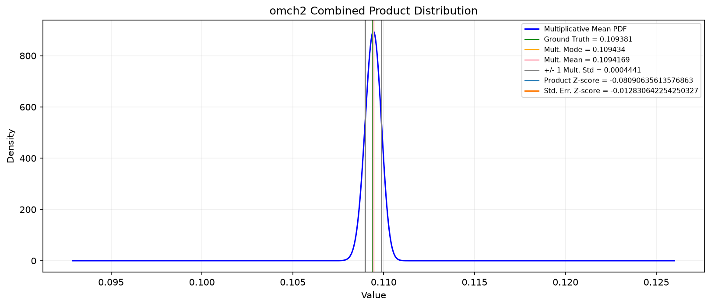
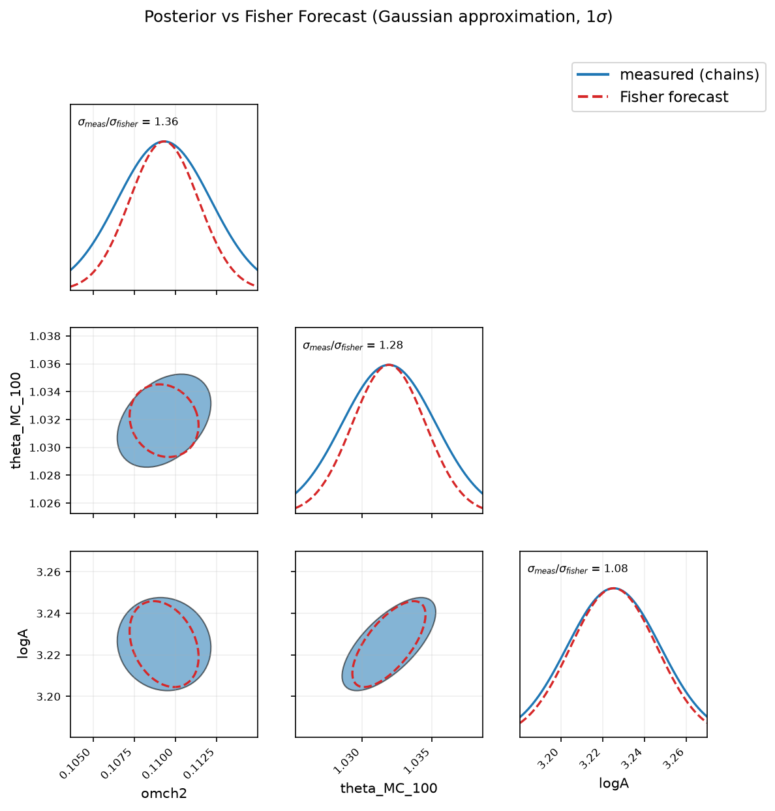

# Summary

[CMBLensing.py](https://github.com/zaneblood1/CMBLensing.py) [@CMBLensing.py] is the Python migration of [CMBLensing.jl](https://github.com/marius311/CMBLensing.jl) [@CMBLensing.jl], a Julia package for simulating Cosmic Microwave Background (CMB) fields, gravitational lensing, Maximum A Posteriori (MAP) estimates of CMB fields, and cosmological parameter sampling. Written in JAX [@jax2018github], most of its methods are Just-In-Time (JIT) compilable and run on CPU or GPU without special configuration. CMBLensing.py reproduces the full functionality of the original code and has been extensively tested for regressions. We have also extended the Julia sampler - which originally sampled the tensor-to-scalar ratio $r$ and the lensing potential band power $A_\phi$ [@Millea_2020] - to jointly sample any subset of 5 of the Lambda Cold Dark Matter (LCDM) cosmological parameters, taking a prior value on the optical depth to reionization $\tau_{\mathrm{reio}}$ due to its strong degeneracies with the other parameters. For map sizes up to $256^2$ pixels the two implementations are comparable in run time; for larger maps some methods are a few factors slower in Python.

# Statement of Need

We migrated CMBLensing.jl into Python for better integration with other Python-based machine learning and inference projects, planned and ongoing, that we are developing. Calling CMBLensing.jl from Python previously required the ```juliacall``` [@PythonCall.jl] package and forced the user to write Julia inside a Python string, making debugging and iteration slow and tedious.

<!--
Additionally, there was not much documentation in the original Julia implementation and the code was highly encapsulated and abstracted. Such a high level of abstraction means a developer has to write fewer lines of code for a given task but also can obfuscate the actual inner workings of the algorithms being employed. Throughout the Python migration, we have taken time to make sure methods are well-documented and have tried to strike a balance in terms of abstraction versus readability of the code. This should make future iteration and debugging of the Python implementation faster and less prone to error. 
-->

The LCDM parameter sampler is also a novel addition, expanding on the algorithm of [@Millea_2020] for jointly sampling $r$ and $A_\phi$. As far as we know, it is the first sampler to infer the LCDM parameters at the field level rather than from the CMB power spectra. We have used it to jointly infer $\left[\log(A_s), \theta_{MC}, \Omega_c h^2\right]$ from lensed temperature maps at varying white noise levels, with the other LCDM parameters fixed at fiducial values.

# State of the Field

```map_joint``` computes MAP estimates of the unlensed CMB fields and the lensing potential from a noisy lensed data map (or set of maps); here we compare its run time and accuracy between the two implementations. Both packages contain other CMB analysis tools, such as ```lense_flow``` [@Millea_2019] for gravitationally lensing CMB fields and ```load_sim``` for synthetic data generation, but ```map_joint``` is a good all around benchmark since it brings many methods together into a single tool. The LCDM sampler is left to the **Research Impact Statement** section, since it is novel and cannot be directly compared between languages.

We ran ```map_joint``` on temperature plus polarization data and stored the cached run time per language, averaged over 10 input data maps and 10 trials per map, at several square map sizes; the configuration is in Table 1, the results in Figure 1 and Table 2. Even after caching, run time varies between map seeds of the same size, due to the variable line search which finds the optimal step size at each iteration. The two implementations agree within 1 standard deviation at smaller map sizes, but at the largest map tested Python is up to 4 times slower than Julia.


| Quantity | Value |
| --- | --- |
| Data | Temperature plus polarization (```IP```) |
| Map sizes | $128^2$, $256^2$, $512^2$, $1024^2$ pixels |
| Resolution | $2.5$ arcminutes per pixel |
| White noise level | $3$ $\mu K$ arcminutes in $T$, $\sqrt{2} \times 3$ $\mu K$ arcminutes in $E$ and $B$ |
| $1/f$ noise | $\ell$-knee $= 100$, $\alpha$-knee $= 3$ |
| Beam | None (FWHM $= 0$) |
| Mask | No pixel space sky mask. Fourier space low-pass held at unity through $\ell = 2950$, then a cosine ramp down to zero at $\ell = 3000$ |
| ```num_steps``` | $30$ |
| Data maps per map size | $10$ |
| Trials per data map | $10$ |
| Cached timing measurements per map size, per language | $100$ |

Table: Configuration of the ```map_joint``` run time and accuracy comparison experiment. Every data map is generated by the Julia ```load_sim``` implementation and handed to both language implementations, so the two are timed on bit-for-bit identical inputs.


| Map Size | Julia Average (s) | Python Average (s) | Python / Julia |
| --- | --- | --- | --- |
| $128^2$ | $99.46 \pm 41.7$ | $192.9 \pm 82.5$ | $1.94$ |
| $256^2$ | $550.4 \pm 342$ | $769.4 \pm 300$ | $1.4$ |
| $512^2$ | $2332 \pm 537$ | $4799 \pm 1440$ | $2.06$ |
| $1024^2$ | $6712 \pm 1450$ | $25700 \pm 3930$ | $3.83$ |

Table: Cached ```map_joint``` run times (mean $\pm$ standard deviation) versus map size for temperature plus polarization (```IP```) data. The same data as shown in Figure $1$.

Figures 2 and 3 compare accuracy. Figure 2 takes the data maps of Figure 1 and compares the average fractional difference between the Julia MAP estimates and the ground truth fields against the same quantity for Python. Only 4 series of lines are visible to the naked eye, so neither implementation is closer to the ground truth than the other; they agree to within numerical precision.


Figure 3 shows the average cross correlation of the ground truth fields with the Python and Julia MAP estimates, and of the two estimates with each other. The green lines stay nearly constant at 1, indicating the estimates agree on every length scale and are statistically identical.


# Software Design

CMBLensing.py was migrated method by method, ensuring the two implementations produced outputs identical to within numerical precision for the same inputs. One of the first methods ported was ```lense_flow```, which iteratively lenses a CMB temperature or polarization field given the unlensed fields and lensing potential [@Millea_2019]. The Wiener filter, likelihood, and gradient methods followed, packaged into the main ```map_joint``` entry point.

<!--
The simulation code in ```load_sim``` was diffed between the two language implementations by generating on the order of 100 maps for the same input cosmological parameters, computing the average power spectra for these maps, and ensuring the average generated power spectra matched within uncertainity between Julia and Python.--> 

Before implementing the new LCDM sampler, the machinery which jointly sampled $(r, A_\phi)$ was ported and confirmed to learn the same distributions between implementations for the same input maps. The step sampling those parameters was then swapped for one drawing LCDM parameter samples, leaving the neighboring field and lensing potential samplers untouched.

Unit tests in the ```\tests``` folder validate that corresponding methods in the two implementations produce identical outputs.

# Research Impact Statement

Besides making CMBLensing natively available in JAX, the sampling algorithm in ```sample_lcdm.py``` represents the first field-level joint inference of the LCDM parameters that we are aware of. Other work, such as ```TODO```, has inferred them from the CMB power spectra, whereas we use image data as the input. The main entry point to the sampling algorithm is ```sample_joint```. We include an example HPC slurm submission script in ```\sampling_chains_TEMPLATE```.

During development we confirmed that each of the 5 sampled parameters could be learned in isolation with the other 4 held at ground truth.  We also find that learning $\left[\log(A_s), \theta_{MC}, \Omega_ch^2\right]$ jointly is relatively easy for smaller temperature maps. The sampler could in theory be applied to larger subsets or the full set of 6 LCDM parameters, but in practice the map sizes needed to break the degeneracies and produce meaningful distributions with small widths become prohibitively large.

Table 3 outlines an experiment jointly inferring $\left[\log(A_s), \theta_{MC}, \Omega_ch^2\right]$ on 128 x 128 square pixel temperature maps.

| Quantity | Value |
| --- | --- |
| Data | Temperature only (```I```) |
| Map size | $128^2$ pixels |
| Resolution | $2.5$ arcminutes per pixel |
| White noise level | $5$ $\mu K$ arcminutes |
| $1/f$ noise | None |
| Beam | None (FWHM $= 0$) |
| Mask | None |
| Sampled parameters | $\log(A_s)$, $\theta_\mathrm{MC}$, $\Omega_ch^2$ |
| Parameters held at ground truth | $\Omega_bh^2$, $n_s$, $\tau_\mathrm{reio}$ |
| Ground truth $\left[\log(A_s), \theta_{MC}, \Omega_ch^2, \Omega_bh^2, n_s, \tau_\mathrm{reio}\right]$ | $\left[3.218387, 1.031732, 0.109381, 0.022386, 0.959814, 0.05\right]$ |
| Search range, $\theta_\mathrm{MC}$ | $[0.9328, 1.1452]$ |
| Search range, $\log(A_s)$ | $[2.661635, 3.782861]$ |
| Search range, $\Omega_ch^2$ | $[0.085, 0.155541]$ |
| Chain starting points | Drawn at random inside the search ranges |
| $\theta$ step | Sequential 1 dimensional random walk Metropolis, with proposal widths $\theta_\mathrm{MC} = 3.5 \times 10^{-3}$, $\log(A_s) = 2.5 \times 10^{-2}$, $\Omega_ch^2 = 3 \times 10^{-3}$ |
| $\phi$ step | HMC with ```num_steps``` $= 10$ and ```step_size``` $= 0.05$ |
| $\phi$ initialization | Zero |
| Iterations with $\theta$ held fixed | $100$ |
| Data map realizations | $50$ |
| Sub-chains per data map | $5$ |
| Iterations per sub-chain | $6000$ |
| Burn-in discarded per sub-chain | $600$ samples |
| Thinning | By each sub-chain's integrated autocorrelation time |
| Convergence | Average Gelman-Rubin $\hat{R} < 1.05$ |

Table: Configuration of the joint $\left[\log(A_s), \theta_{MC}, \Omega_ch^2\right]$ sampling experiment run with ```sample_joint```.


After running the 50 map realizations and 5 sub-chains per map of Table 3 for 6000 iterations each, burn-in was removed, the sub-chains thinned by their integrated auto-correlation time and concatenated into 50 processed chains, one per map. A Gaussian kernel density estimate on each gives 50 "per-map" distributions, whose product is taken and re-normalized. Its mean is our best estimate, across all input data maps, of a given parameter's fiducial value. Figure 4 shows the result for $\Omega_ch^2$; plots for $\log(A_s)$ and $\theta_\mathrm{MC}$ are in the ```\supplementary_materials``` folder.



For the given noise level, map size, resolution, and sampler inputs we can compute a Fisher forecast for the expected lower bound on an individual map's learned uncertainty and compare it to the empirical widths. Figure 5 shows a triangle plot with Fisher in red and experimental results in blue. The experimental widths are only slightly larger, indicating our sampler performs close to optimally.



<!--

# Mathematics

In this section we outline some of the mathematical formalism which the software implements.

## The Likelihood Function

The likelihood function that we use in this code base and which the ```map_joint``` method seeks to minimize is given below as:

$$\log\left(\mathcal{P}\left(f, \phi, \vec{\theta} \left.|\right. d\right)\right) = \frac{\left(d - \mathcal{L}\left(\phi\right)\cdot f\right)^2}{C_n} + \frac{f^2}{C_f\left(\vec{\theta}\right)} + \frac{\phi^2}{C_\phi\left(\vec{\theta}\right)}$$

where $f$ represents an unlensed CMB field, $\phi$ the lensing potential, $\mathcal{L}(\phi)$ the lensing operator,  $d$ the data map, $\vec{\theta}$ the vector of LCDM parameters, and the $C_i$'s the covariance matrices evaluated at the current value of $\vec{\theta}$. 

## The Mixed Parameterization

In practice, if we were to work in this so-called "unlensed parameterization" when performing our sampling algorithm, the burn-in time would tend toward infinity and we would never effectively explore the parameter space. Instead, we work in the so-called "mixed parameterization" which was originally developed in [@Millea_2020]. This re-parameterization defined below makes the parameter space more Gaussian and less degenerate and empirically reduces the burn-in time of the sampler. 

$$\phi^\circ \equiv G(\vec{\theta})\cdot\phi$$

$$f^\circ \equiv \mathcal{\phi} \cdot D(\vec{\theta})\cdot f$$

$$G(\vec{\theta}) \equiv \sqrt{1 + 2\cdot N_\phi/C_\phi(\vec{\theta})}$$

$$D(\vec{\theta}) \equiv \sqrt{(C_f(\vec{\theta}) + \alpha \cdot I + 2\cdot C_n)/C_f(\vec{\theta})}$$

$$\alpha \equiv \mathrm{jnp.deg2rad}\left(\left(5 / 60\right)^2\right)$$

Where $I$ is the identity matrix, $N_\phi$ is the effective noise in the $\phi$ estimate, and the chosen value of $\alpha$ is a tuning parameter which should be re-tuned if the noise level of the experiment changes. The form of the log-likehood in the mixed parameterization then becomes:

$$\log\left(\mathcal{P}\left(f^\circ, \phi^\circ, \vec{\theta} \left.|\right. d\right)\right) = \log\left(\mathcal{P}\left(f, \phi, \vec{\theta} \left.|\right. d\right)\right) - \log \det \left(G\left(\vec{\theta}\right)\right) - \log \det \left(D\left(\vec{\theta}\right)\right)$$

## Sampling Pseudocode

The sampling algorithm found in ```sample_lcdm.py``` works by repeatedly drawing conditional samples of $f$, $\phi$, and $\theta \in \vec{\theta}$ over and over again and keeping track of the relative frequency of each LCDM parameter so that after thousands of iterations a good approximation of the distribution for each parameter can be computed. To be specific, during each iteration of the sampler we do the following in order:

1. Draw a sample for the unlensed CMB field $f \sim \mathcal{P}(f | \phi, \vec{\theta}, d)$ via a conjugate gradient method.

2. Draw a sample for the lensing potential $\phi \sim \mathcal{P}(\phi | f, \vec{\theta}, d)$ using Hamiltonian Monte Carlo.

3. For each of the $N$ LCDM parameters being sampled, draw a sample $\theta_i \sim \mathcal{P}(\theta_i | f, \phi, \{\theta_j, \forall j \neq i\}, d)$ using 1-D Metropolis Hastings

-->

# Limitations

In theory our sampler could jointly infer all 6 LCDM parameters at once, but in practice the largest subset we could learn in testing was just 3. Many of the LCDM parameters are strongly degenerate, and breaking those degeneracies requires adding polarization data and increasing map size and resolution, all of which significantly slow down sampling. One iteration takes less than 3 seconds for 128 x 128 temperature-only maps with 4 cpus-per-task on Caltech's Resnick HPC [@caltech_hpc], but preliminary testing suggests a joint inference of just 5 of the parameters (excluding $\tau_\mathrm{reio}$) could require temperature plus polarization maps of at least 1024 x 1024 square pixels, at minimum a 192x increase in total run time. Running on GPU empirically gives at least a 4x speed increase, which cannot counteract the >192x slowdown projected.

Besides these time complexity problems, researchers should be aware of the many tuning knobs which must be adjusted to get well-behaved, non-pathological chains. For a given map size, resolution, and noise level, a pilot chain must be run before any large HPC experiment to confirm optimal acceptance rates: around 65% for the $\phi$ HMC step [@beskos2010optimaltuninghybridmontecarlo] and around 44% for each of the 1-D Metropolis-Hastings steps of the $N$ sampled LCDM parameters [@10.1214/aoap/1034625254]. Tuning is time intensive: the user must wait for the samples to burn in, record the acceptance rates, and adjust the knobs, repeatedly, until the optimal rates are achieved.

Perhaps the most troublesome limitation is the current mixing scheme we employ to decouple the field and lensing potential in our sampler. We use the mixing matrices $G$ and $D$ defined in [@Millea_2020] which are computed in terms of the noise covariance matrix. For these matrix definitions, low SNR yields good mixing, but also large widths in the computed distributions for the most difficult parameters to learn, e.g. $n_s$ or $\Omega_bh^2$. Learning these parameters would require a high SNR, but dropping the noise level diminishes the mixing matrices to the point that we either never burn in to the typical set or only ever sample the mode of the distribution. A mathematically justified mixing scheme decoupled from the experiment's noise would be a major area for future improvement, though we have been unable to find one.

# AI Usage Disclosure

Claude Code was used for code generation in parts of the code base and for preparation of this manuscript.  All AI generated code was reviewed by a human before being merged.

# Acknowledgements

The computations presented here were conducted in the Resnick High Performance Computing Center, a facility supported by Resnick Sustainability Institute at the California Institute of Technology.

```TODO``` who else do we wish to acknowledge?

# References
